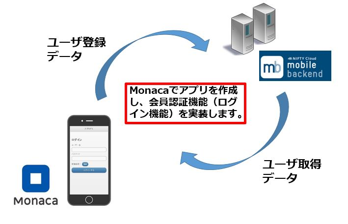
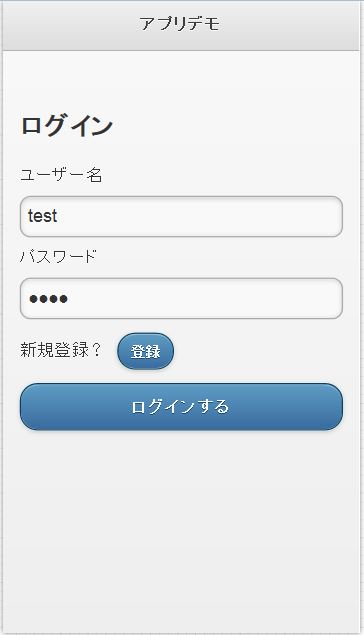
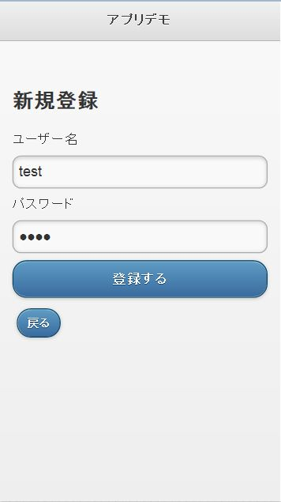
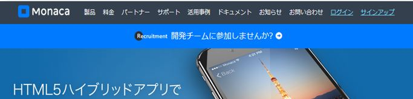
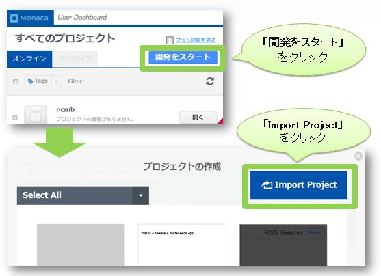
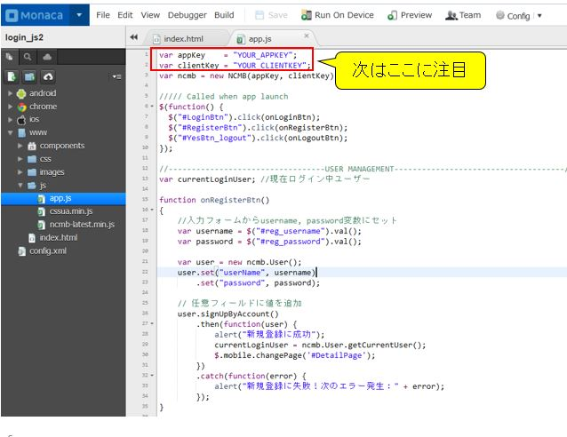
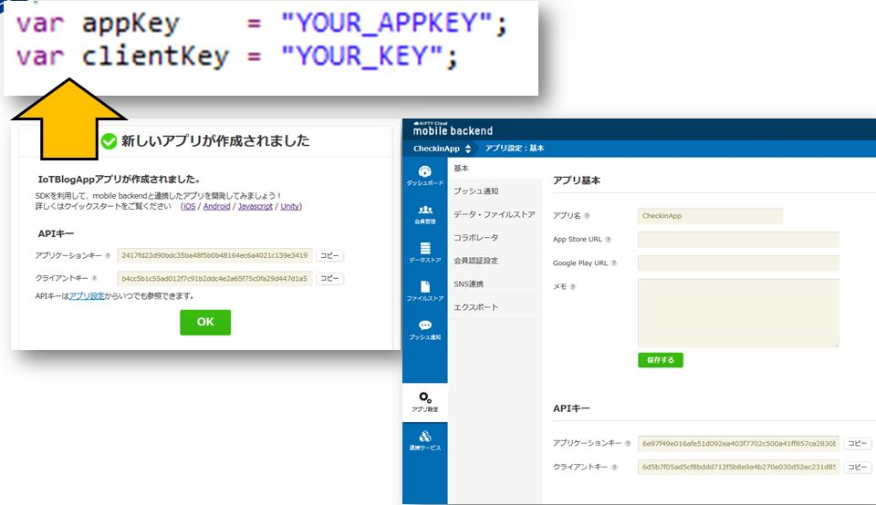

# Monaca x NIFTY Cloud mobile backend 会員ログインサンプル

===

# Overview

Monacaを用いて作ったアプリとmobile backendを連携して、ログイン機能を実装するサンプルコードとなります。
* HTML/CSS/JavaScriptでマルチプラットフォーム（iOS/Android/Windowsなど）にアプリを開発できる統合開発環境[Monaca](https://ja.monaca.io/)
* スマホアプリのサーバ側機能（プッシュ通知、会員管理、DBなど）をサーバ開発不要で実装できる[NIFTY Cloud mobile backend](http://mb.cloud.nifty.com/?utm_source=community&utm_medium=referral&utm_campaign=sample_monaca_login_template)



## Demo

MonacaでgithubのURL（https://github.com/ncmbadmin/monaca_login_template/archive/master.zip）をインポートし、
アプリケーションキーとクライントキーを設定してください。

最初にログイン画面がでますので、「登録」ボタンを押し、登録画面へ遷移します。
登録画面にて、「ユーザー名」＋「パスワード」を入力し、ユーザー登録を行います。

その後、ログイン画面に戻り、登録した「ユーザー名」＋「パスワードの組み合わせで」
ログインができることを確認します。

※mBaaS管理画面の「会員管理」タブにて、ユーザー登録が完了したことを確認できます。

* ログイン画面



* ユーザー新規登録画面




## Requirement

* Monaca環境
* Nifty cloud mobile backend Javascript SDK version 1.2.6　ダウンロード：[Javascript SDK](http://mb.cloud.nifty.com/doc/1.2.6/introduction/sdkdownload_javascript.html?utm_source=community&utm_medium=referral&utm_campaign=sample_monaca_data_registration)
* ※version 2.0.0はまだ準備中です。


## Installation

* Monacaで新規アプリ作成し、プロジェクトをインポートする。
  - Monacaの利用登録
    [Monaca](https://ja.monaca.io/)

  - Monacaで新規プロジェクトを作成し、プロジェクトのインポートを選択します。

  - 「URLからインポートする」を選択し、URLに https://github.com/ncmbadmin/sample_monaca_login_template/archive/master.zip を指定します。


* mobile backendでアプリ作成する
  - mobile backend 利用登録
    [NIFTY Cloud mobile backend](http://mb.cloud.nifty.com/?utm_source=community&utm_medium=referral&utm_campaign=sample_monaca_login_template)

  - mobile backendでアプリ作成する


* Monacaで作成したアプリをmobile backendサーバーと連携させる
  - Monacaでアプリケーションキー、クライアントキーを設定し、初期化を行う


キーをコピーし、追記します。


  - monacaで動作確認する


## Description

* コードの説明

File: www/js/app.js

 - 初期化設定

```JavaScript
var appKey    = "YOUR_APPKEY";
var clientKey = "YOUR_CLIENTKEY";
var ncmb = new NCMB(appKey, clientKey);
```

上記のコードでアプリケーションキーとクライアントキーを指定し、
NCMB(appKey, clientKey)　でmBaaSサーバと連携を行います。

 - ユーザ登録

NCMB.Userクラスを利用して、ユーザ登録を行います。

最初にuserという変数をNCMB.Userクラスのインスタンスとして作成します。
userに対し、set("key", "value")というメソッドを利用して、username, passwordをセットします。
他の属性（たとえば年齢や性別など）も、同様の形でセットできます。

セット後、signUpByAccount()メソッドを利用し、ユーザ登録を非同期にて行います。
メソッドチェインを行い、then(), catch() それぞれの場合の処理を定義します。
成功の場合、alertを出し、currentLoginUserをセットしてから、#DetailPageに遷移させます。

```JavaScript
//入力フォームからusername, password変数にセット
var username = $("#reg_username").val();
var password = $("#reg_password").val();

var user = new ncmb.User();
user.set("userName", username)
    .set("password", password);

// 任意フィールドに値を追加
user.signUpByAccount()
    .then(function(user) {
        alert("新規登録に成功");
        currentLoginUser = ncmb.User.getCurrentUser();
        $.mobile.changePage('#DetailPage');
    })
    .catch(function(error) {
        alert("新規登録に失敗！次のエラー発生：" + error);
    });
```

 - ユーザーログイン

ncmb.Userクラスを利用し、ユーザログインを行います。
ncmb.Userのloginメソッドを利用し、username, passwordを渡し、非同期にてログインを行います。
メソッドチェインを行い、then(), catch() それぞれの場合の処理を定義します。
ログイン成功した場合、alertを出し、currentLoginUserをセットしてから、#DetailPageに遷移します。

```JavaScript
var username = $("#login_username").val();
var password = $("#login_password").val();
// ユーザー名とパスワードでログイン
ncmb.User.login(username, password)
    .then(function(user) {
        alert("ログイン成功");
        currentLoginUser = ncmb.User.getCurrentUser();
        $.mobile.changePage('#DetailPage');
    })
    .catch(function(error) {
        alert("ログイン失敗！次のエラー発生: " + error);
    });
```

 - ユーザーログアウト

ncmb.Userクラスを利用し、ユーザログアウトを行います。
ncmb.Userのlogoutメソッドを利用し、ログアウトを行います。
ログアウトの後、currentLoginUserをリセットし、#LoginPageに遷移します。

```JavaScript
ncmb.User.logout();
alert('ログアウト成功');
currentLoginUser = null;
$.mobile.changePage('#LoginPage');
```

## Usage

サンプルコードをカスタマイズすることで、様々な機能を実装できます！
データ保存・データ検索・会員管理・プッシュ通知などの機能を実装したい場合には、
以下のドキュメントもご参考ください。

* [ドキュメント](http://mb.cloud.nifty.com/doc/current/?utm_source=community&utm_medium=referral&utm_campaign=sample_monaca_login_template)
* [ドキュメント・データストア](http://mb.cloud.nifty.com/doc/current/sdkguide/javascript/datastore.html?utm_source=community&utm_medium=referral&utm_campaign=sample_monaca_login_template)
* [ドキュメント・会員管理](http://mb.cloud.nifty.com/doc/current/sdkguide/javascript/user.html?utm_source=community&utm_medium=referral&utm_campaign=sample_monaca_login_template)
* [ドキュメント・プッシュ通知](http://mb.cloud.nifty.com/doc/current/sdkguide/javascript/push.html?utm_source=community&utm_medium=referral&utm_campaign=sample_monaca_login_template)

## Contributing

1. Fork it!
2. Create your feature branch: `git checkout -b my-new-feature`
3. Commit your changes: `git commit -am 'Add some feature'`
4. Push to the branch: `git push origin my-new-feature`
5. Submit a pull request :D

## License

* MITライセンス
* NIFTY Cloud mobile backendのJavascript SDKのライセンス
